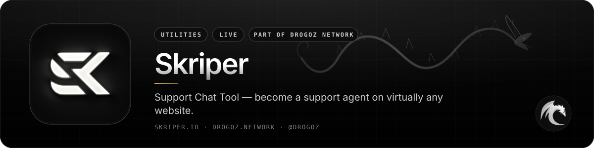
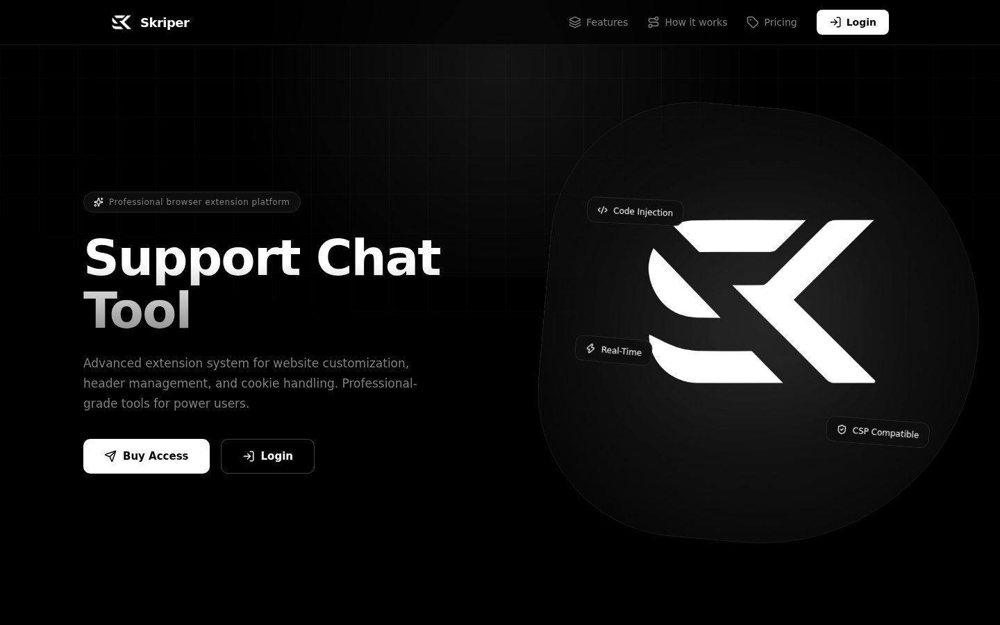
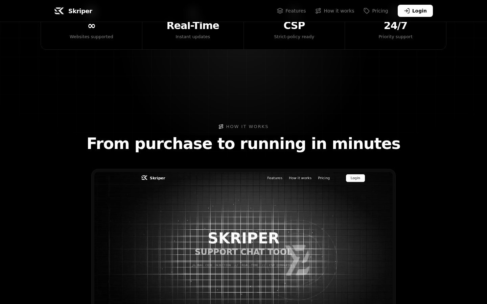
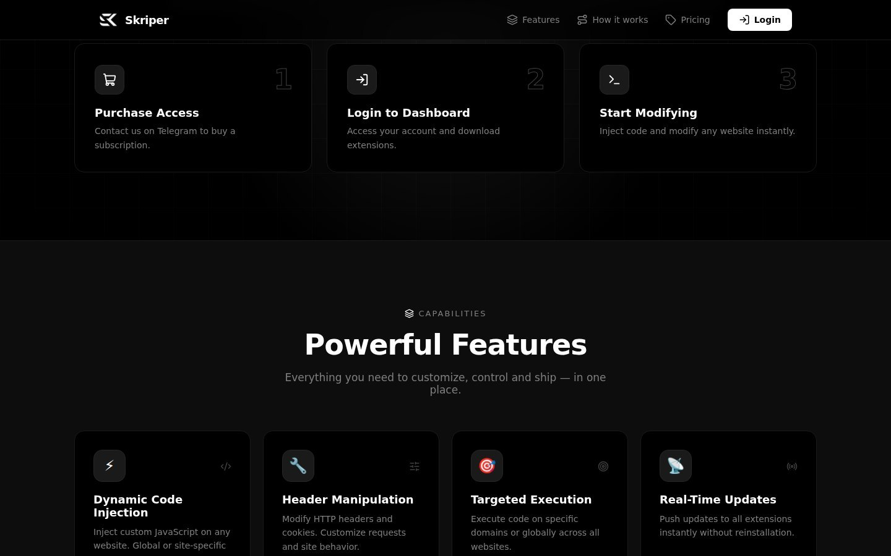
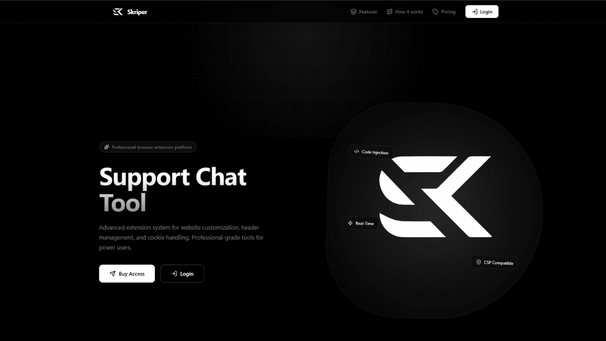
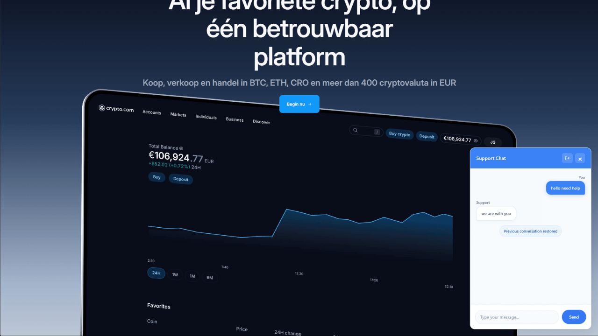

 

# Skriper

### Support Chat Tool — become a support agent on virtually any website.

 

  

 

## 📋 Table of contents

- [Overview](#-overview)
- [Key features](#-key-features)
- [Screenshots](#-screenshots)
- [How it works](#%EF%B8%8F-how-it-works)
- [Use cases](#-use-cases)
- [Pricing](#-pricing)
- [Free live demonstration](#-free-live-demonstration)
- [Links](#-links)

## 🧭 Overview

Skriper is a professional browser extension platform and Support Chat Tool. It provides an advanced extension system for website customization, header management and cookie handling — professional-grade tools for power users — and lets you replace and deploy a support chat button on any website.

The platform allows you to become a support agent on virtually any website. Built on a WebSocket-based infrastructure with no blocking issues, it offers real-time injection and deployment, a centralized agent management dashboard and real-time synchronization across all agents — designed to handle high volumes of client interactions efficiently.

Whether you're managing a single operator or an entire team, Skriper offers a fast and reliable solution for customer communication. Customized landing pages tailored to your office and workflow can also be provided. Extensions work smoothly on sites with strict Content Security Policy settings, and updates are pushed to all extensions instantly without reinstallation.

<table>
<tr>
<td align="center" width="25%"><b>Category</b> Utilities</td>
<td align="center" width="25%"><b>Status</b> Live</td>
<td align="center" width="25%"><b>Bundle</b> Utilities (−2%)</td>
<td align="center" width="25%"><b>Pricing</b> Sign in to see pricing</td>
</tr>
</table>

## ✨ Key features

### 💬 Support chat

- **Support Chat Button Replacement & Deployment on Any Website**.
- **Become a Support Agent on Virtually Any Website** with **Live Client Interaction & Support Tools**.
- **Advanced Control CRM System** and **Centralized Agent Management Dashboard**.
- **Real-Time Synchronization Across All Agents**.

### ⚡ Extension engine

- **Dynamic Code Injection** — inject custom JavaScript on any website, globally or per site, in real time.
- **Header Manipulation** — modify HTTP headers and cookies; customise requests and site behaviour.
- **Targeted Execution** — execute code on specific domains or globally across all websites.
- **CSP Compatibility** — works smoothly on sites with strict Content Security Policy settings.

### 📡 Infrastructure

- **WebSocket-Based Infrastructure with No Blocking Issues**.
- **Real-Time Injection & Deployment System** — push updates to all extensions instantly without reinstallation.
- **∞ websites supported** · 24/7 priority support.

### 🧰 Tooling & business

- **Admin Dashboard** — manage extensions, view analytics and control all features from one place.
- **Extension Generator** — create custom-branded extensions with your own name, description and logo in seconds.
- **Billing System** — built-in balance management, crypto payments and automated service delivery.
- **Additional services** — Add Website, Branding Change, Redactor Extension, Custom Feature; customised landing pages on request.

## 🖼️ Screenshots

> Product images from [skriper.io](https://skriper.io/) and the [service page](https://drogoz.network/services/Skriper/) on drogoz.network.

<table>
<tr>
<td width="50%" align="center"> Skriper — Support Chat Tool</td>
<td width="50%" align="center"> Skriper — From purchase to running in minutes</td>
</tr>
<tr>
<td width="50%" align="center"> Skriper — Powerful features</td>
<td width="50%" align="center"> Skriper — product interface</td>
</tr>
<tr>
<td colspan="2" align="center"> Skriper — product interface</td>
</tr>
</table>

## ⚙️ How it works

**From purchase to running in minutes**

```mermaid
%%{init: {'theme': 'dark', 'themeVariables': { 'primaryColor': '#1a1a1a', 'primaryTextColor': '#ffffff', 'primaryBorderColor': '#c9a855', 'lineColor': '#c9a855', 'secondaryColor': '#0d0d0d', 'tertiaryColor': '#0d0d0d', 'clusterBkg': '#0d0d0d', 'clusterBorder': '#404040', 'edgeLabelBackground': '#0d0d0d', 'fontFamily': 'Inter, Segoe UI, sans-serif' } } }%%
flowchart LR
    A["1 · Purchase Access<br/>contact the team on Telegram, pick a plan"] --> B["2 · Access Your Dashboard<br/>credentials · download extensions & packages"]
    B --> C["3 · Deploy & Start Working<br/>connect agents, work with clients in real time"]
    subgraph Runtime["Runtime"]
        direction LR
        X["Browser extension<br/>code injection · headers · cookies · CSP-ready"] <-->|"WebSocket"| S["Skriper server<br/>real-time sync · instant updates"]
        S <--> D["Agent dashboard / CRM<br/>multi-agent · analytics · billing"]
    end
    C --> Runtime
```

## 🎯 Use cases

<table>
<tr>
<td width="50%" valign="top"><b>🎧 Live support teams</b> Replace the support chat button on any website and handle client conversations in real time.</td>
<td width="50%" valign="top"><b>👥 Multi-agent offices</b> Centralized agent management with real-time synchronization across all agents.</td>
</tr>
<tr>
<td width="50%" valign="top"><b>🧪 Power users</b> Targeted or global code injection, header and cookie control, CSP-compatible.</td>
<td width="50%" valign="top"><b>🏷️ White-label operators</b> Generate custom-branded extensions with your own name, description and logo.</td>
</tr>
</table>

## 💳 Pricing

> **Sign in at [drogoz.network](https://drogoz.network/accounts/login/) to see pricing.** Billed per user · Min. 10 users.

Skriper is part of the **Utilities** bundle (−2%) — *Core utility tools* — and of **All In One** (−10%) — *Every product, best price*. Take several products together and save more: [Packages & bundles](https://drogoz.network/#packages) · [Pricing & calculator](https://drogoz.network/pricing/).

| Bundle | Discount | Included |
|---|---|---|
| **Utilities** | −2% | Drog AI, MyMask AI, Replika, IMPERATORI, RiderSwap, Vadira, Skriper |
| **All In One** | −10% | Drog AI, MyMask AI, Replika, Lidaro AI, IMPERATORI, ZOI Talks, RiderSwap, HyperBlast AI, VerifHub AI, Vadira, Skriper |

## 🎥 Free live demonstration

**A live demonstration is 100% free on every product.** 
See Skriper in action before you pay — our agent gets in touch and walks you through a live demonstration.

Registration is handled by our team — get in touch and receive personal access.

## 🔗 Links

| Channel | Link |
|---|---|
| 🌐 **Website** | [skriper.io](https://skriper.io/) |
| 📄 **Details page** | [drogoz.network/services/Skriper/](https://drogoz.network/services/Skriper/) |
| ✈️ **Telegram group** | [@skriper_io](https://t.me/skriper_io) |
| 🏛️ **Drogoz Network** | [drogoz.network](https://drogoz.network) · [Services](https://drogoz.network/#services) · [Packages](https://drogoz.network/#packages) · [Pricing](https://drogoz.network/pricing/) · [Presentation](https://drogoz.network/presentation/) |
| ⚖️ **Legal** | [Terms of Service](https://drogoz.network/legal/terms-of-service/) · [Acceptable Use](https://drogoz.network/legal/acceptable-use-policy/) · [Privacy](https://drogoz.network/legal/privacy-policy/) · [Refunds](https://drogoz.network/legal/refund-policy/) · [Disclaimer](https://drogoz.network/legal/disclaimer/) · [Compliance](https://drogoz.network/legal/compliance-policy/) |
| 🐙 **GitHub** | [deepdrogo](https://github.com/deepdrogo/deepdrogo) |

 

   
  
    
  <b>Made by <a href="https://drogoz.network">Drogoz Network</a></b> 
  One network — all your services · Premium SaaS Network
    
  
  
  
  
    
  <b>More from the network:</b> <a href="https://github.com/deepdrogo/drog-ai">Drog AI</a> · <a href="https://github.com/deepdrogo/mymask-ai">MyMask AI</a> · <a href="https://github.com/deepdrogo/replika">Replika</a> · <a href="https://github.com/deepdrogo/lidaro-ai">Lidaro AI</a> · <a href="https://github.com/deepdrogo/imperatori">IMPERATORI</a> · <a href="https://github.com/deepdrogo/zoi-talks">ZOI Talks</a> · <a href="https://github.com/deepdrogo/riderswap-io">RiderSwap</a> · <a href="https://github.com/deepdrogo/hyperblast-ai">HyperBlast AI</a> · <a href="https://github.com/deepdrogo/verifhub-ai">VerifHub AI</a> · <a href="https://github.com/deepdrogo/vadira-net">Vadira</a> · <a href="https://github.com/deepdrogo/mytasker">MyTasker</a> · <a href="https://github.com/deepdrogo/mamont-tech">Mamont</a> · <a href="https://github.com/deepdrogo/drogscan">DrogScan</a>
    
  © 2026 Drogoz Network. All rights reserved. Provided strictly for lawful use — see the <a href="https://drogoz.network/legal/">Legal Center</a>. Each user is solely responsible for how they use the software.

